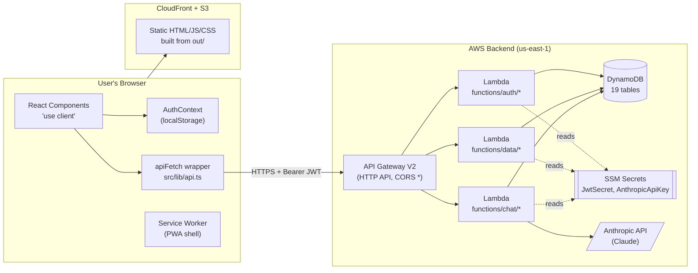
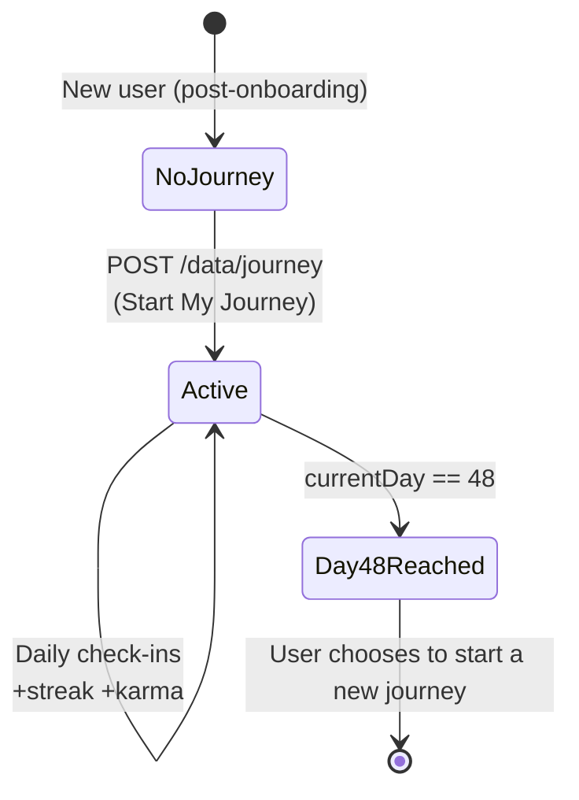
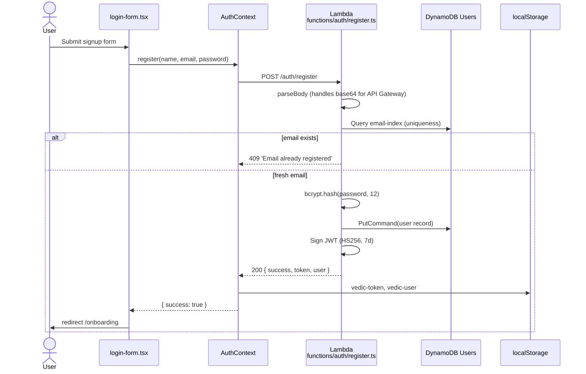
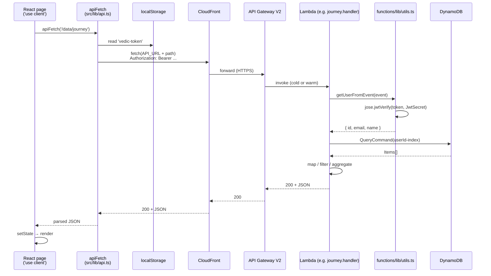
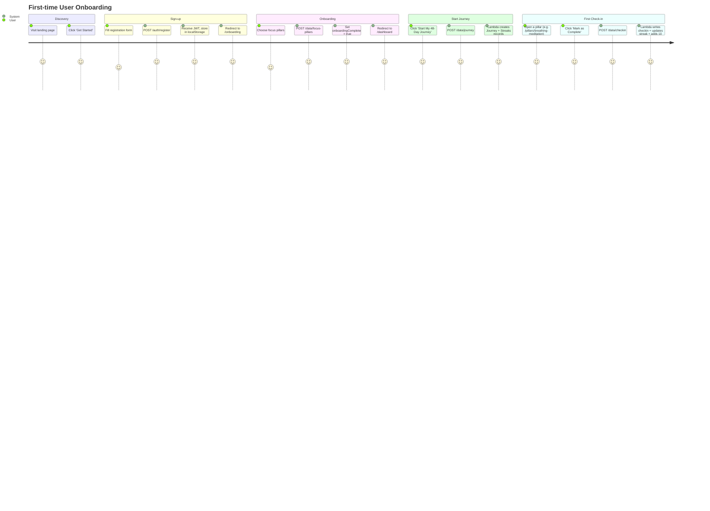
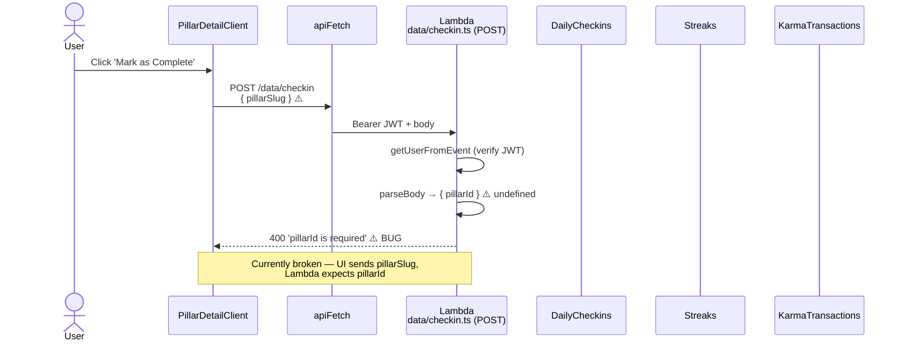
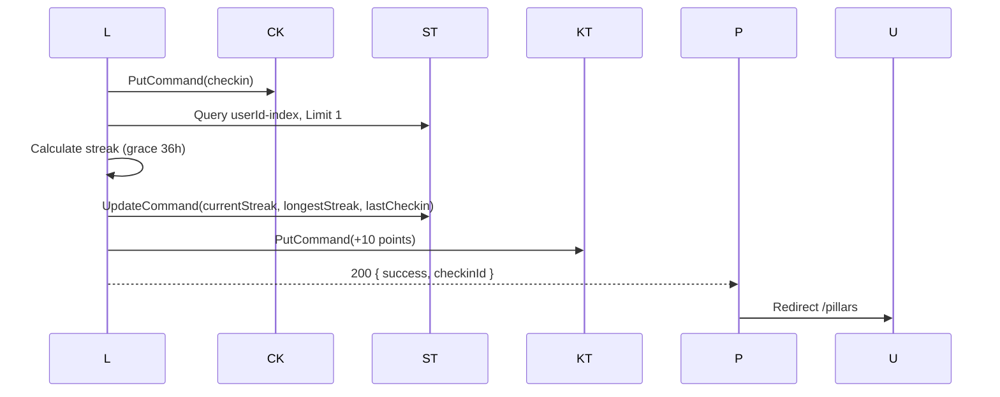
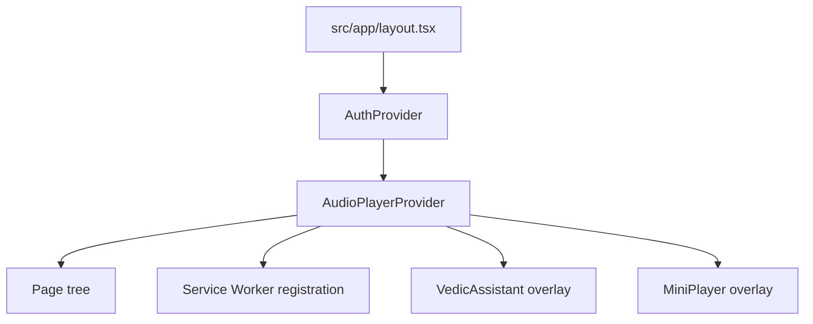
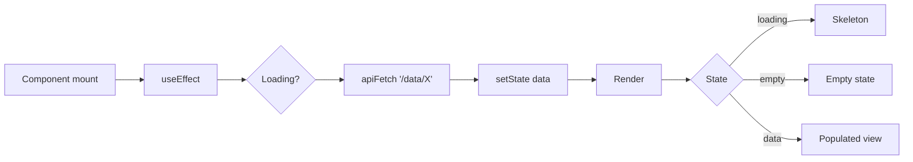
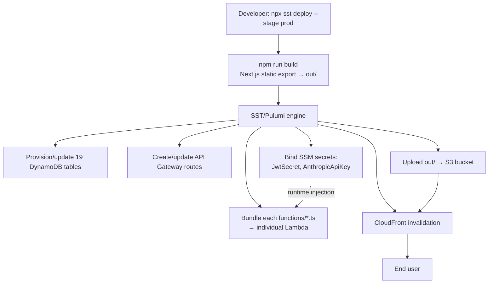

# 10X Vedic Transform — Project Flow Documentation

**Version:** 1.0  ·  **Generated:** 2026-04-27  ·  **Repo:** `C:\Projects\Vedic_transform`

A 48-day spiritual + behavioural transformation program built on Next.js 16 (static export), AWS Lambda, DynamoDB, and SST v3.

---

## Table of Contents

1. [Executive Summary](#1-executive-summary)
2. [Technology Stack](#2-technology-stack)
3. [System Architecture](#3-system-architecture)
4. [Repository Layout](#4-repository-layout)
5. [The 48-Day Journey Cycle](#5-the-48-day-journey-cycle)
6. [The 11 Pillars](#6-the-11-pillars)
7. [Authentication & Session Flow](#7-authentication--session-flow)
8. [Routing — Frontend & Backend Maps](#8-routing--frontend--backend-maps)
9. [End-to-End Request Lifecycle](#9-end-to-end-request-lifecycle)
10. [User Journeys (Step-by-Step)](#10-user-journeys-step-by-step)
11. [Data Model — DynamoDB Tables](#11-data-model--dynamodb-tables)
12. [Backend Layer — Shared Lambda Helpers](#12-backend-layer--shared-lambda-helpers)
13. [Frontend Composition & State](#13-frontend-composition--state)
14. [Deployment Pipeline](#14-deployment-pipeline)
15. [Operational Concerns](#15-operational-concerns)
16. [Security Posture](#16-security-posture)
17. [Known Issues & Tech Debt](#17-known-issues--tech-debt)
18. [Quick Reference](#18-quick-reference)

---

## 1. Executive Summary

10X Vedic Transform is a guided 48-day program combining ancient Vedic practices with modern habit-formation tools. The product is structured around **11 transformation pillars** spanning body, mind, and spirit. Users start a journey, perform daily check-ins for any of the pillars, build streaks, earn karma points, and progress through the cycle.

The application is technically a **single-page React app served from S3/CloudFront** that talks to a **pure serverless backend** (API Gateway V2 + AWS Lambda + DynamoDB). There is no traditional web server, no SSR, no SQL, and no ORM — every backend handler is its own Lambda function and every database call is a raw AWS SDK command.

| Property | Value |
|---|---|
| Architecture style | Static SPA + serverless API |
| Compute | AWS Lambda (Node.js 20 runtime, one function per route) |
| Database | DynamoDB (19 tables, on-demand billing) |
| Edge | CloudFront + S3 |
| API surface | API Gateway V2 (HTTP API), 27+ routes |
| Auth | Custom JWT (HS256, 7-day expiry, `jose` library) |
| Frontend | Next.js 16.1.1 with `output: "export"` (static export) |
| IaC | SST v3.17.25 (Pulumi-based) |
| Estimated monthly cost | ~$1.60–$2.00 at low traffic |
| Production URL | https://d1wkrhl40vhx82.cloudfront.net |

---

## 2. Technology Stack

| Layer | Technology | Version | Notes |
|---|---|---|---|
| UI framework | Next.js | 16.1.1 | Static export only, no SSR |
| Language | TypeScript | 5.x | Strict mode |
| Styling | Tailwind CSS | 4.x | With shadcn/ui primitives |
| UI primitives | Radix UI | latest | Behind shadcn wrappers |
| Icons | Lucide React | latest | Per-pillar icons |
| Auth library (server) | jose | latest | HS256 JWT signing/verification |
| Password hashing | bcryptjs | latest | Cost factor 12 |
| Cloud SDK | `@aws-sdk/client-dynamodb`, `@aws-sdk/lib-dynamodb` | v3 | Document client |
| AI assistant | Anthropic SDK | latest | Claude via `/chat` Lambda |
| Build / IaC | SST + OpenNext + Pulumi | 3.17.25 | |
| Cloud provider | AWS | — | us-east-1 only |

---

## 3. System Architecture



### Why "static export"?

`next.config.ts` sets `output: "export"`, which removes all server-side capabilities from the Next.js app. The implications:

- All pages are `"use client"` (server components cannot fetch data at render time).
- There is **no `middleware.ts`** for route protection — guards are JS-side only.
- All data fetching happens after hydration (`useEffect → fetch`).
- The `NEXT_PUBLIC_API_URL` environment variable is **baked into the JS bundle at build time** — changing it requires a rebuild and redeploy.

---

## 4. Repository Layout

```
Vedic_transform/
├── src/                            # Frontend (Next.js → out/)
│   ├── app/
│   │   ├── (public)/               # Marketing pages (no auth)
│   │   │   ├── about/
│   │   │   ├── blog/
│   │   │   ├── faq/
│   │   │   ├── how-it-works/
│   │   │   └── pillars-overview/
│   │   ├── (auth)/                 # Auth & onboarding (no guard)
│   │   │   ├── login/
│   │   │   ├── register/
│   │   │   └── onboarding/
│   │   ├── (main)/                 # AuthGuard-protected app
│   │   │   ├── dashboard/
│   │   │   ├── pillars/
│   │   │   ├── pillars/[pillarId]/
│   │   │   ├── journal/
│   │   │   ├── goals/
│   │   │   ├── progress/
│   │   │   ├── reports/
│   │   │   ├── mood/
│   │   │   ├── insights/
│   │   │   ├── library/
│   │   │   ├── sessions/
│   │   │   ├── reminders/
│   │   │   ├── settings/
│   │   │   ├── achievements/
│   │   │   └── wisdom/
│   │   └── page.tsx                # Landing page (HomePageClient)
│   ├── components/
│   │   ├── ui/                     # Primitives (Button, Card, Progress)
│   │   ├── layout/                 # Sidebar, Header, MobileNav, PublicNavbar
│   │   ├── features/               # Domain widgets (analytics, dashboard, sessions)
│   │   └── auth-guard.tsx          # Client-side route protection
│   ├── context/
│   │   ├── auth-context.tsx        # User + token + login/logout
│   │   └── audio-player-context.tsx
│   ├── lib/
│   │   └── api.ts                  # apiFetch wrapper
│   └── constants/
│       └── pillars.ts              # 11 pillars (single source of truth)
│
├── functions/                       # AWS Lambda backend
│   ├── auth/
│   │   ├── login.ts
│   │   └── register.ts
│   ├── data/
│   │   ├── achievements.ts
│   │   ├── assessment.ts
│   │   ├── checkin.ts
│   │   ├── content-progress.ts
│   │   ├── focus-pillars.ts
│   │   ├── goals.ts
│   │   ├── insights.ts
│   │   ├── journal.ts
│   │   ├── journey.ts
│   │   ├── mood.ts
│   │   ├── notifications.ts
│   │   ├── reminders.ts
│   │   ├── reports.ts
│   │   └── user.ts
│   ├── chat/
│   │   └── chat.ts
│   └── lib/
│       └── utils.ts                # Shared: db, JWT, parseBody, errors, CORS
│
├── sst.config.ts                    # ALL infrastructure (tables, routes, secrets)
├── next.config.ts                   # output: 'export'
├── docs/
│   └── PROJECT_FLOW.md              # ← This document
└── public/                          # Static assets, PWA icons
```

---

## 5. The 48-Day Journey Cycle

The entire app revolves around exactly one **active 48-day journey per user**. The 48-day "Mandala cycle" framing comes from the AI assistant's system prompt (`functions/chat/chat.ts:6,9`) and is anchored in habit-formation neurobiology.

### 5.1 Lifecycle



### 5.2 How the 48 days are stored

`functions/data/journey.ts:38-51` (POST handler):

```ts
const now = new Date();
const endDate = new Date(now);
endDate.setDate(endDate.getDate() + 48);

const journey = {
  id: journeyId,
  userId: user.id,
  startDate: now.toISOString(),
  endDate: endDate.toISOString(),
  isActive: true,
  createdAt: now.toISOString(),
  updatedAt: now.toISOString(),
};
```

### 5.3 How `currentDay` is derived

It is **not stored** — it's computed each time the dashboard or reports endpoint runs. From `functions/data/reports.ts:60-65`:

```ts
let journeyDay = 0;
if (activeJourney) {
  const start = new Date(activeJourney.startDate);
  const now = new Date();
  journeyDay = Math.floor((now.getTime() - start.getTime()) / 86400000) + 1;
}
```

### 5.4 Constraints

- One active journey per user at a time. POST /data/journey returns **409 Conflict** if `isActive` already exists (`functions/data/journey.ts:36`).
- A `Streaks` record is created alongside the journey (`functions/data/journey.ts:59-71`).
- After day 48 the journey does not auto-close. There is no scheduled job in `sst.config.ts` that ends it. The user must manually start a new one.
- `src/constants/pillars.ts:185` exports `TOTAL_JOURNEY_DAYS = 48` for the UI.

---

## 6. The 11 Pillars

All defined in `src/constants/pillars.ts`. Categorized into Body / Mind / Spirit:

| # | Slug | Name | Sanskrit | Category | Default min | Karma base |
|---|---|---|---|---|---|---|
| 1 | `morning-initiation` | 5 AM Initiation | Brahma Muhurta | body | 10 | 15 |
| 2 | `nutrition-fasting` | Vedic Nutrition + Fasting | Ahara Vidhi | body | 0 | 10 |
| 3 | `thoughts-intention` | Thoughts & Intention Reset | Sankalpa | mind | 5 | 12 |
| 4 | `breathing-meditation` | Breathing + Meditation | Pranayama | mind | 15 | 15 |
| 5 | `movement` | Movement Everyday | Vyayama | body | 30 | 12 |
| 6 | `healing-meditation` | Healing Meditation | Dhyana | mind | 20 | 15 |
| 7 | `gratitude` | Gratitude Practice | Kritajnata | mind | 5 | 10 |
| 8 | `sandhya-meditation` | Sandhya Meditation | Sandhyavandana | spirit | 15 | 20 |
| 9 | `brahman-connection` | Connection to Brahman | Brahma Sambandha | spirit | 10 | 15 |
| 10 | `divine-manifestation` | Divine Manifestation | Sankalpa Shakti | spirit | 10 | 12 |
| 11 | `sleep-optimization` | Sleep Optimization | Nidra | body | 0 | 10 |

> **Note:** Despite the per-pillar `karmaPointsBase`, the check-in Lambda awards a **flat 10 points** for every check-in (`functions/data/checkin.ts:101`). The per-pillar values are not currently honored on the backend.

---

## 7. Authentication & Session Flow

### 7.1 Registration



### 7.2 Login

Same shape as register. The Lambda (`functions/auth/login.ts`):

1. Accepts `{ email, password }`
2. Queries `Users` by `email-index` GSI
3. Returns 401 on missing user OR failed `bcrypt.compare`
4. On success, signs a fresh JWT and returns `{ success, token, user }`

### 7.3 JWT Details

From `functions/lib/utils.ts:32-47`:

```ts
export async function createToken(payload: any): Promise<string> {
  return new SignJWT(payload)
    .setProtectedHeader({ alg: 'HS256' })
    .setIssuedAt()
    .setExpirationTime('7d')
    .sign(getJwtSecret());
}

export async function verifyToken(token: string): Promise<any | null> {
  try {
    const { payload } = await jwtVerify(token, getJwtSecret());
    return payload;
  } catch {
    return null;
  }
}
```

- Algorithm: **HS256** (symmetric)
- Secret: `Resource.JwtSecret.value` — managed by SST, stored in SSM Parameter Store
- Expiry: **7 days**
- Payload: `{ id, email, name }`

### 7.4 Route Protection (client-side only)

`src/components/auth-guard.tsx`:

```tsx
export function AuthGuard({ children }) {
  const { user, isLoading } = useAuth();
  const router = useRouter();

  useEffect(() => {
    if (!isLoading && !user) router.push("/login");
  }, [user, isLoading, router]);

  if (isLoading) return <Spinner />;
  if (!user) return null;
  return <>{children}</>;
}
```

`src/app/(main)/layout.tsx:29` wraps every protected route in `<AuthGuard>` and additionally redirects to `/onboarding` if `user.onboardingCompleted === false`.

> **Security caveat:** Because there is no `middleware.ts`, direct URL access to a protected route briefly serves the static HTML shell before the JS-side redirect fires. The token also lives in `localStorage`, which is XSS-accessible — not in an `HttpOnly` cookie.

### 7.5 Authenticated request — every protected Lambda

From `functions/lib/utils.ts:73-77`:

```ts
export async function getUserFromEvent(event: any): Promise<any | null> {
  const authHeader = event.headers?.authorization || event.headers?.Authorization;
  if (!authHeader?.startsWith('Bearer ')) return null;
  return verifyToken(authHeader.slice(7));
}
```

Every protected Lambda's first action is:

```ts
const user = await getUserFromEvent(event);
if (!user) return err(401, 'Unauthorized');
```

---

## 8. Routing — Frontend & Backend Maps

### 8.1 Frontend Routes

| Group | Auth required | Layout | Routes |
|---|---|---|---|
| `(public)` | No | `PublicNavbar` + `PublicFooter` | `/`, `/about`, `/blog`, `/faq`, `/how-it-works`, `/pillars-overview` |
| `(auth)` | No (but onboarding assumes logged in) | bare | `/login`, `/register`, `/onboarding` |
| `(main)` | **Yes (AuthGuard)** | `Sidebar` + `Header` + `MobileNav` | `/dashboard`, `/pillars`, `/pillars/[pillarId]`, `/journal`, `/goals`, `/progress`, `/reports`, `/mood`, `/insights`, `/library`, `/sessions`, `/reminders`, `/settings`, `/achievements`, `/wisdom` |

### 8.2 Backend Routes (API Gateway)

Source: `sst.config.ts:264-438`. Every route is a separate Lambda. The API base URL is exposed as `NEXT_PUBLIC_API_URL` to the frontend at build time.

| Method | Path | Lambda Handler | Tables Linked |
|---|---|---|---|
| POST | `/auth/register` | `auth/register.handler` | Users |
| POST | `/auth/login` | `auth/login.handler` | Users |
| GET, PATCH | `/data/user` | `data/user.handler` | Users |
| GET, POST | `/data/journey` | `data/journey.handler` | Journeys, Streaks |
| GET, POST | `/data/checkin` | `data/checkin.handler` | DailyCheckins, Streaks, KarmaTransactions |
| GET, POST, PATCH, DELETE | `/data/goals` | `data/goals.handler` | GoalTasks |
| GET, POST | `/data/focus-pillars` | `data/focus-pillars.handler` | FocusPillars |
| GET, POST | `/data/journal` | `data/journal.handler` | GratitudeEntries, Intentions, Manifestations |
| GET, POST | `/data/mood` | `data/mood.handler` | MoodLogs |
| GET, POST | `/data/assessment` | `data/assessment.handler` | SelfAssessments |
| GET, POST, PATCH | `/data/insights` | `data/insights.handler` | UserInsights |
| GET, PUT | `/data/reminders` | `data/reminders.handler` | ReminderSettings |
| GET | `/data/reports` | `data/reports.handler` | Journeys, DailyCheckins, KarmaTransactions, Streaks, UserBadges |
| GET, PATCH | `/data/notifications` | `data/notifications.handler` | Notifications |
| GET, POST | `/data/content-progress` | `data/content-progress.handler` | ContentProgress |
| GET | `/data/achievements` | `data/achievements.handler` | Badges, UserBadges |
| POST | `/chat` | `chat/chat.handler` | (uses Anthropic API) |

### 8.3 What is NOT a route

The README mentions `src/app/api/` — **this directory does not exist**. There is one backend layer (the Lambdas), not two.

The login form references the following routes which **have no Lambda handler**:

- `/auth/verify-email`
- `/auth/resend-verification`
- `/auth/forgot-password`
- `/auth/reset-password`
- `/auth/oauth/authorize`

Buttons triggering these flows will hit a 404 from API Gateway.

---

## 9. End-to-End Request Lifecycle

### 9.1 Anatomy of an authenticated read



### 9.2 The shared `apiFetch` wrapper

`src/lib/api.ts`:

```ts
export async function apiFetch(path: string, options?: RequestInit & { token?: string }) {
  const { token, ...fetchOptions } = options || {};
  const headers: Record<string, string> = {
    "Content-Type": "application/json",
    ...(options?.headers as Record<string, string> || {}),
  };

  const savedToken = token || (typeof window !== "undefined"
    ? localStorage.getItem("vedic-token")
    : null);
  if (savedToken) headers["Authorization"] = `Bearer ${savedToken}`;

  const res = await fetch(`${API_URL}${path}`, { ...fetchOptions, headers });
  return res.json();
}
```

Every protected page in the app uses this single helper. It always parses the response as JSON — there is **no error handling for non-JSON responses** (e.g., a 500 HTML page from API Gateway will throw).

### 9.3 Standard Lambda response envelope

Defined in `functions/lib/utils.ts:9-26`:

```ts
export const CORS_HEADERS = {
  'Content-Type': 'application/json',
  'Access-Control-Allow-Origin': '*',
  'Access-Control-Allow-Methods': 'GET,POST,PUT,PATCH,DELETE,OPTIONS',
  'Access-Control-Allow-Headers': 'Content-Type,Authorization',
};

export const ok  = (data) => ({ statusCode: 200,    headers: CORS_HEADERS, body: JSON.stringify(data) });
export const err = (s, m) => ({ statusCode: s,      headers: CORS_HEADERS, body: JSON.stringify({ error: m }) });
```

Every Lambda also short-circuits CORS preflight:

```ts
if (event.requestContext?.http?.method === 'OPTIONS')
  return { statusCode: 200, headers: CORS_HEADERS, body: '' };
```

---

## 10. User Journeys (Step-by-Step)

### 10.1 First-time user (signup → first check-in)



### 10.2 Returning user dashboard load

`src/app/(main)/dashboard/page.tsx` (line ~32):

1. `AuthGuard` confirms `user` is hydrated from localStorage.
2. Three parallel `apiFetch` calls fire in `useEffect`:
   - `GET /data/journey` → active journey, all journeys
   - `GET /data/checkin?date=YYYY-MM-DD` → today's check-ins
   - `GET /data/reports` → totals (karma, streak, badges, pillarStats)
3. State is set; loading skeletons swap to populated widgets.
4. If no active journey → renders the "Start My 48-Day Journey" CTA.

### 10.3 Daily check-in (most common action)



**If the bug is fixed (UI sends `pillarId`):**



The streak logic from `functions/data/checkin.ts:70-88`:

```ts
const lastCheckin = streak.lastCheckin ? new Date(streak.lastCheckin) : null;
const today = new Date(checkinDate);
const isConsecutive = lastCheckin &&
  (today.getTime() - lastCheckin.getTime()) <= 86400000 * 1.5;

const newCurrent = isConsecutive ? streak.currentStreak + 1 : 1;
const newLongest = Math.max(newCurrent, streak.longestStreak);
```

---

## 11. Data Model — DynamoDB Tables

All 19 tables are provisioned in `sst.config.ts:23-250`. Every table uses `id` (string) as the partition key (except `ReminderSettings`, which uses `userId`). User-scoped tables have a `userId-index` GSI.

### 11.1 Schema overview

| # | Table | PK | GSI | Purpose / shape highlights |
|---|---|---|---|---|
| 1 | `Users` | `id` | `email-index` | `{id, email, passwordHash, name, phone, avatarUrl, onboardingCompleted, createdAt, updatedAt}` |
| 2 | `Journeys` | `id` | `userId-index` | `{id, userId, startDate, endDate, isActive, createdAt, updatedAt}` |
| 3 | `Pillars` | `id` | — | **Provisioned but unused** — pillar data lives in `src/constants/pillars.ts` |
| 4 | `DailyCheckins` | `id` | `userId-index` | `{id, userId, pillarId, checkinDate, completed, durationMinutes, notes, moodBefore, moodAfter, createdAt, updatedAt}` |
| 5 | `Streaks` | `id` | `userId-index` | `{id, userId, journeyId, currentStreak, longestStreak, lastCheckin, createdAt, updatedAt}` |
| 6 | `KarmaTransactions` | `id` | `userId-index` | `{id, userId, points, reason, pillarId, badgeId, createdAt}` |
| 7 | `Badges` | `id` | — | Badge definitions (full Scan in achievements handler) |
| 8 | `UserBadges` | `id` | `userId-index` | Earned badges junction |
| 9 | `GratitudeEntries` | `id` | `userId-index` | Daily gratitude items |
| 10 | `Intentions` | `id` | `userId-index` | Daily intention setting |
| 11 | `Manifestations` | `id` | `userId-index` | Goals / manifestations |
| 12 | `MoodLogs` | `id` | `userId-index` | Mood / energy / stress |
| 13 | `SelfAssessments` | `id` | `userId-index` | Self-evaluation responses |
| 14 | `GoalTasks` | `id` | `userId-index` | Weekly goals |
| 15 | `FocusPillars` | `id` | `userId-index` | Onboarding focus selection |
| 16 | `UserInsights` | `id` | `userId-index` | AI/system-generated insights |
| 17 | `ReminderSettings` | `userId` | — | One row per user |
| 18 | `ContentProgress` | `id` | `userId-index` | Library watch/read state |
| 19 | `Notifications` | `id` | `userId-index` | In-app notifications |

### 11.2 Query pattern

All user-scoped reads look like:

```ts
db.send(new QueryCommand({
  TableName: Resource.<Table>.name,
  IndexName: 'userId-index',
  KeyConditionExpression: 'userId = :userId',
  ExpressionAttributeValues: { ':userId': user.id },
}));
```

Date filtering (e.g., today's check-ins) is done with a `FilterExpression` *after* the GSI returns all of a user's items. This means a user with 1,000 check-ins still pays read units for all 1,000 every time the dashboard loads.

### 11.3 ID generation

`functions/lib/utils.ts:57-59`:

```ts
export function generateId(): string {
  return `${Date.now().toString(36)}${Math.random().toString(36).substr(2, 9)}`;
}
```

Compact, sortable by approximate insert time, but not collision-proof at high concurrency. Acceptable for current scale.

### 11.4 Cross-table relationships (manual joins)

DynamoDB has no joins. The reports endpoint, for example, runs five sequential queries and aggregates in Lambda memory. The dashboard view of "pillar progress" is built by:

1. Load all `DailyCheckins` for the user.
2. Group by `pillarId` to get a count.
3. Map back to `PILLARS` from `src/constants/pillars.ts` for display metadata.

---

## 12. Backend Layer — Shared Lambda Helpers

### 12.1 The `db` singleton

`functions/lib/utils.ts:7`:

```ts
export const db = DynamoDBDocumentClient.from(new DynamoDBClient({}));
```

Created once per Lambda **container**. Re-used across warm invocations. No connection pooling required — DynamoDB uses HTTP.

### 12.2 Body parsing (handles base64)

`functions/lib/utils.ts:61-71`:

```ts
export function parseBody(event: any): any {
  let body = event.body || '{}';
  if (event.isBase64Encoded && typeof body === 'string') {
    body = Buffer.from(body, 'base64').toString('utf-8');
  }
  try { return JSON.parse(body); }
  catch { return {}; }
}
```

This was added in commit `224b1db` ("fix: add parseBody helper to handle base64 encoded API Gateway requests") and applied to all handlers in `08b461a`.

### 12.3 Permissions model

Each route in `sst.config.ts` declares which resources its Lambda can access via the `link:` array — for example:

```ts
const checkinLink = [dailyCheckins, streaks, karmaTransactions, jwtSecret];
api.route("POST /data/checkin", { handler: "...", link: checkinLink });
```

SST translates this into IAM policies. **The check-in Lambda has no permission to read the `Users` table**, for instance. This is good least-privilege practice.

---

## 13. Frontend Composition & State

### 13.1 Provider tree



### 13.2 Data-fetching pattern (universal)



There is **no global data cache** (no React Query, no SWR). Every page navigation re-fetches its data. This is acceptable for a personal-tracker app but means dashboards can feel sluggish during cold starts.

### 13.3 Component organization

| Folder | Purpose | Examples |
|---|---|---|
| `src/components/ui/` | Headless primitives | `Button`, `Card`, `Progress`, `Input`, `Select` |
| `src/components/layout/` | App shell | `Sidebar`, `Header`, `MobileNav`, `PublicNavbar`, `PublicFooter` |
| `src/components/features/{domain}/` | Domain widgets | `dashboard/StreakWidget`, `analytics/KarmaChart`, `sessions/SessionTimer` |
| `src/components/auth-guard.tsx` | Protection HOC | Used in `(main)/layout.tsx` |

---

## 14. Deployment Pipeline



### 14.1 Stage management

`sst.config.ts:7`:

```ts
removal: input?.stage === "production" ? "retain" : "remove",
```

- `production` stage **retains** DynamoDB tables on `sst remove`.
- All other stages (dev, PR previews) **delete** them.

### 14.2 Environment injection

`sst.config.ts:441-449`:

```ts
const site = new sst.aws.StaticSite("VedicTransformSite", {
  build: {
    command: "npm run build",
    output: "out",
  },
  environment: {
    NEXT_PUBLIC_API_URL: api.url,
  },
});
```

The API URL is **resolved at deploy time** and inlined into the JS bundle. There is no runtime config endpoint.

### 14.3 Secrets

```ts
const jwtSecret = new sst.Secret("JwtSecret");
const anthropicApiKey = new sst.Secret("AnthropicApiKey");
```

Set via:

```bash
npx sst secret set JwtSecret <value> --stage production
npx sst secret set AnthropicApiKey <value> --stage production
```

Stored in SSM Parameter Store, injected as `Resource.JwtSecret.value` inside Lambda code via SST's resource binding.

---

## 15. Operational Concerns

### 15.1 Cold starts

Each route is its own Lambda. With 27+ routes, each cold start (~300-700ms for Node 20) impacts the **first** invocation of that specific route after idle. The dashboard hits 3 routes in parallel — all 3 may cold-start simultaneously after a quiet period.

Mitigations not currently in place:
- No provisioned concurrency
- No Lambda warmer
- No bundling of multiple routes per Lambda

### 15.2 DynamoDB cost & performance

- **On-demand billing** — pay per read/write unit consumed.
- **Single GSI per table** (`userId-index`) is cheap to maintain.
- **FilterExpression pattern** is wasteful at scale: full GSI scan + in-memory filter for date ranges.
- **Reports endpoint** issues 5 sequential queries — would benefit from `Promise.all`.
- **Achievements endpoint** runs full-table `Scan` on `Badges` per request.

### 15.3 Observability

- No CloudWatch dashboards defined in `sst.config.ts`.
- No structured logging (each handler uses `console.error` with free-form strings).
- No request tracing / X-Ray enabled.
- No alerts on Lambda errors or DynamoDB throttling.

### 15.4 Caching

- CloudFront caches static assets (configured by SST defaults).
- API responses are **not cached** at API Gateway or CloudFront.
- No client-side cache (no React Query / SWR).

---

## 16. Security Posture

| Area | Status | Notes |
|---|---|---|
| Password hashing | ✅ | bcrypt cost 12 |
| JWT signing | ✅ | HS256 with SSM-stored secret |
| Token storage | ⚠️ | `localStorage` — XSS-accessible. Should use `HttpOnly` cookie. |
| Server-side route protection | ❌ | Static export precludes `middleware.ts`. JS-side only. |
| CORS | ⚠️ | Allow-origin is `*`. Should restrict to CloudFront URL in production. |
| Rate limiting | ❌ | No throttling on `/auth/login` — open to brute force. |
| Email verification | ❌ | UI calls `/auth/verify-email` but no Lambda exists. |
| Forgot password | ❌ | UI calls `/auth/forgot-password` but no Lambda exists. |
| OAuth / social login | ❌ | UI references Google OAuth but no implementation. |
| HTTPS | ✅ | Enforced by CloudFront and API Gateway. |
| Secrets in code | ✅ | All in SSM via SST `Resource.*` bindings. |
| Input validation | ⚠️ | Minimal — only required-field checks (no length, format, or sanitization). |
| SQL/NoSQL injection | ✅ | DynamoDB uses parameterized expressions; no string interpolation. |
| Least-privilege IAM | ✅ | Per-route `link:` arrays scope each Lambda's table access. |

---

## 17. Known Issues & Tech Debt

| # | Severity | File | Issue | Fix sketch |
|---|---|---|---|---|
| 1 | **🔴 High** | `pillar-detail-client.tsx:52` vs `functions/data/checkin.ts:33,35` | UI sends `{ pillarSlug }`, Lambda reads `pillarId`. **Every check-in returns 400.** | Either rename the UI key to `pillarId` (and pass the numeric ID), or have the Lambda accept both `pillarSlug` and look up the ID. |
| 2 | **🔴 High** | `src/components/features/auth/login-form.tsx` | Buttons for Google OAuth, email verification, forgot password hit **non-existent** Lambda routes. | Either implement the Lambdas (preferred) or hide the buttons behind a feature flag. |
| 3 | 🟡 Medium | `functions/data/checkin.ts:70-73` | Streak grace-window compares `lastCheckin` (date string) against `today` (parsed as midnight UTC). Behaves inconsistently across timezones. | Store `lastCheckin` as a full ISO timestamp; compare day-of-year in the user's stated timezone. |
| 4 | 🟡 Medium | `src/types/database.types.ts` | Orphaned snake_case Supabase/Prisma types from prior architecture. Mismatch with current camelCase DynamoDB schema. | Delete the file. |
| 5 | 🟡 Medium | `Pillars` table in `sst.config.ts:49-54` | Provisioned but never read or written. | Remove from `sst.config.ts`. |
| 6 | 🟡 Medium | Auth model | Token in `localStorage` (XSS-accessible), no server-side guard. | Migrate to `HttpOnly` cookie + CloudFront edge function for guard. |
| 7 | 🟡 Medium | `functions/data/achievements.ts` | Full-table `ScanCommand` on `Badges` per page load. | Cache badge definitions in memory at module scope. |
| 8 | 🟡 Medium | `functions/data/reports.ts:17-57` | 5 sequential DynamoDB queries per dashboard load. | Wrap in `Promise.all([...])`. |
| 9 | 🟢 Low | Day 49+ behavior | No UI logic for what happens after the 48-day window closes. | Add a "Journey complete!" state on the dashboard. |
| 10 | 🟢 Low | `functions/data/checkin.ts:101` | Awards flat 10 karma regardless of pillar. | Use `karmaPointsBase` from the pillar definition. |
| 11 | 🟢 Low | `functions/lib/utils.ts:57-59` | `generateId()` is timestamp + 9-char random — collision risk at high concurrency. | Use `nanoid` or UUID v7. |
| 12 | 🟢 Low | All Lambdas | No structured logging or X-Ray tracing. | Adopt `aws-lambda-powertools`. |

---

## 18. Quick Reference

### 18.1 Files to read first

| Purpose | File |
|---|---|
| Infrastructure source of truth | `sst.config.ts` |
| Shared Lambda helpers (db, JWT, parseBody) | `functions/lib/utils.ts` |
| Pillar definitions (single source of truth) | `src/constants/pillars.ts` |
| Auth UI | `src/components/features/auth/login-form.tsx` |
| Auth state | `src/context/auth-context.tsx` |
| Route protection | `src/components/auth-guard.tsx` |
| API client wrapper | `src/lib/api.ts` |
| Most complex Lambda (check-in + streak + karma) | `functions/data/checkin.ts` |
| Aggregation Lambda (dashboard) | `functions/data/reports.ts` |
| Journey lifecycle | `functions/data/journey.ts` |
| Static export config | `next.config.ts` |
| Root layout (providers, SW, overlays) | `src/app/layout.tsx` |
| Protected layout (AuthGuard, onboarding gate) | `src/app/(main)/layout.tsx` |

### 18.2 Common commands

```bash
npm install                        # install deps
npm run dev                        # local Next.js dev server
npm run build                      # static export to out/
npx sst dev                        # SST live-Lambda dev mode
npx sst deploy --stage production  # full deploy
npx sst remove --stage dev         # tear down a stage
npx sst secret set JwtSecret <v>   # set a secret
```

### 18.3 Environment variables

| Var | Where | Purpose |
|---|---|---|
| `NEXT_PUBLIC_API_URL` | Build-time, baked into JS bundle | API Gateway base URL |
| `JWT_SECRET` (local `.env`) | Local dev fallback | Used when not deployed via SST |
| `AWS_REGION` | Lambda runtime | Defaults to `us-east-1` |

### 18.4 Cost summary

At the current scale (single-digit users), monthly costs:

- DynamoDB on-demand: < $1
- Lambda invocations: < $0.50
- API Gateway: < $0.50
- CloudFront + S3: < $0.50

**Total: ~$1.60–$2.00/month.**

---

*End of document. Generated from codebase analysis on 2026-04-27.*
