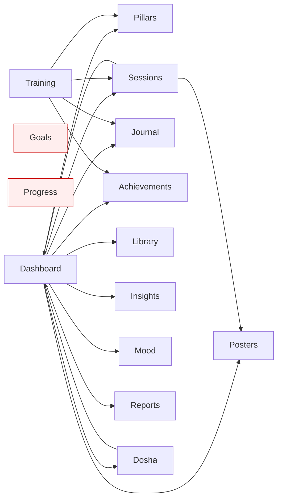
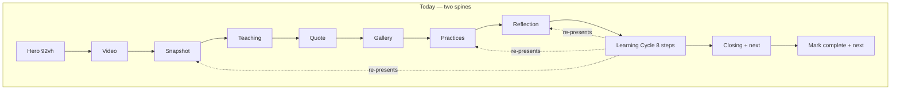
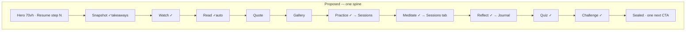
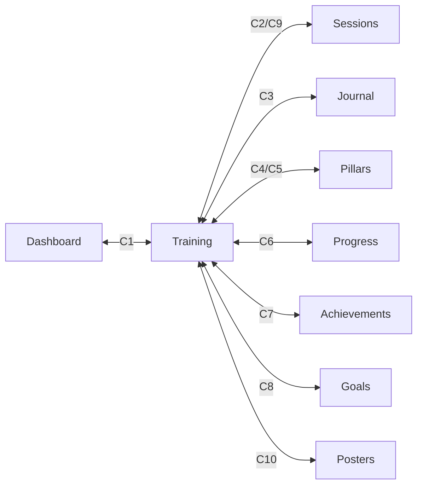

# Training Modules Flow + Left-Menu Connection — Audit, Rearrangement Plan & Implementation Detail

**Date:** 2026-07-28
**Status:** Draft for review (not implemented)
**Scope:** (a) the training program module flow, (b) every left-menu surface, (c) how they should connect to each other.

> This document is written to be reviewable by a second reader with no prior
> context. Every claim about current behaviour cites the file and line it came
> from, so the audit can be checked independently of the proposal.

---

## Part 0 — Method and source of truth

Everything in Part 1 was read directly from the codebase on 2026-07-28. Files read in full:

| File | Lines | Why |
|---|---|---|
| `src/components/layout/sidebar.tsx` | 165 | Desktop left menu |
| `src/components/layout/mobile-nav.tsx` | 166 | Mobile bottom nav + "More" sheet |
| `src/app/(main)/training/page.tsx` | 503 | Training landing |
| `src/app/(main)/training/[slug]/page.tsx` | 270 | Chapter router + fallback reader |
| `src/components/features/training/chapter-experience.tsx` | 521 | The chapter flow |
| `src/components/features/training/chapter-journey.tsx` | 617 | The 8-step learning cycle |
| `src/components/features/training/chapter-accordion.tsx` | 212 | The teaching movements |
| `src/components/features/training/lesson-outline.tsx` | 189 | Outline drawer |
| `src/app/(main)/training/[slug]/chapter-actions.tsx` | 126 | Mark-complete + prev/next |
| `src/app/(main)/dashboard/page.tsx` | 421 | Dashboard |
| `src/app/(main)/pillars/page.tsx` | 374 | Pillars index |
| `src/app/(main)/sessions/page.tsx` | 122 | Sessions tabs |
| `src/app/(main)/progress/page.tsx` | 309 | Progress |
| `src/app/(main)/goals/page.tsx` | 200 | Goals |
| `src/lib/practice-routes.ts` | 93 | Pillar → practice routing |
| `src/data/training-book.ts` | (schema + chapter metadata) | Chapter model |
| `src/constants/pillars.ts` | (metadata) | 11 pillars |
| `src/lib/journey-phases.ts` | (metadata) | 6 journey phases |

Link graph was derived by grepping every `href="/…"` under `src/app/(main)` and
`src/components`. That grep is the basis for the "orphan" claims in §2.1.

---

## Part 1 — Current state

### 1.1 The left menu, item by item

**Desktop** (`sidebar.tsx:30–51`) — two groups, flat:

| # | Item | Route | What the page actually is | Data it reads | Links *out* to |
|---|---|---|---|---|---|
| P1 | Dashboard | `/dashboard` | 12-component daily home: phase banner + mandala ring, cohort banner, recovery ritual, reflection, daily brief, daily short, Today's Practice, streak, karma, pillar grid, quick actions, Discover | `/data/journey`, `/data/checkin`, `/data/reports`, `/data/focus-pillars`, `/data/mood` | journal, dosha-assessment, library, insights, pillars/*, posters, mood, reports, achievements, sessions |
| P2 | Pillars | `/pillars` | 11 pillars in 3 tiers (Active / Recommended for phase / Quiet) + today's progress bar | `/data/checkin`, `/data/focus-pillars`, `/data/journey` | `/pillars/<slug>` only |
| P3 | Sessions | `/sessions` | 15 tabs of interactive practice; `?practice=<key>` deep-links a tab | none at page level (each tab self-fetches) | `/posters`, `/dashboard` (from completion CTA) |
| P4 | Goals | `/goals` | Weekly goals + focus-pillar selector | `/data/journey`, `/data/goals`, `/data/focus-pillars`, `/data/checkin` | — (no outbound links) |
| P5 | Progress | `/progress` | Consistency score, Sutra Book, weekly trend, pillar radar, calendar heatmap, insights, pillar consistency, badges | `/data/reports` | — (no outbound links) |
| P6 | Journal | `/journal` | Journal entries | journal API | — |
| P7 | Training | `/training` | The 12-chapter book | `/data/content-progress` | `/achievements` only |

**Tools** (`sidebar.tsx:40–51`): Library, Posters, Dosha Quiz, Wisdom, Mood, Achievements, Insights, Reports, Reminders, Settings. Admin appended when `user.role === "admin"`.

**Mobile** (`mobile-nav.tsx:29–50`) — a *different* IA:

- Bottom bar: Home, Pillars, Sessions, Progress
- "More" sheet: Goals, Journal, Library, **Training**, Posters, Dosha, Wisdom, Mood, Achievements, Insights, Reports, Reminders, Settings

> **Finding N1.** Training is a top-level primary item on desktop and a
> 4th-row item inside a "More" sheet on mobile. Journal and Goals have the same
> split. The two navs encode two different opinions about what matters.

### 1.2 The link graph as it exists



Read that graph carefully — it is the whole problem in one picture:

- **Dashboard is the only hub.** Ten outbound edges. Every other surface has ≤4.
- **Nothing links *into* Training** except the sidebar. Not the dashboard, not a
  pillar, not progress, not achievements.
- **Goals and Progress are sinks.** Zero outbound links. You arrive and the only
  way onward is the sidebar.
- **Training's four outbound edges are all buried at the bottom of a chapter**
  (`chapter-experience.tsx:411` journal, `:496` pillar; `chapter-journey.tsx:418`
  sessions, `:444` journal; `training/page.tsx:453` achievements).

### 1.3 The chapter flow, in current order

`ChapterExperience` renders, top to bottom:

| # | Section | Source | Note |
|---|---|---|---|
| 1 | Dark hero, `min-h-[92vh]`, ambient video, Sanskrit epigraph, "Enter the Chapter" | `chapter-experience.tsx:151–216` | A full viewport before any content |
| 2 | Cinematic lesson (YouTube) | `:219–235` | Only if `lessonVideoId` |
| 3 | Chapter snapshot: description, key takeaways, meta chips, "N-step learning cycle ↓" | `:245–304` | |
| 4 | The Teaching — accordion of movements | `:307–322` → `ChapterAccordion` | |
| 5 | Night interlude pull-quote | `:325–338` | |
| 6 | Chapter Gallery (study cards) | `:341–349` | |
| 7 | Daily Practices | `:352–369` → `PracticeCards` | |
| 8 | Reflection questions + "Write in your journal" | `:372–420` | |
| 9 | **Your Learning Cycle** — 8 steps | `:425–431` → `ChapterJourney` | |
| 10 | Sunrise closing: summary + "Continue to <next>" | `:436–480` | |
| 11 | Lesson outline drawer (fixed right tab) | `:482–489` | |
| 12 | Pillar link + `ChapterActions` (mark complete, prev/next) | `:492–518` | |

And `ChapterJourney`'s 8 steps (`chapter-journey.tsx:60–124`) are:
`read → watch → takeaways → practice → meditation → reflection → quiz → challenge`.

### 1.4 The two progress models

There are two unrelated progress systems in this app, and the training flow
contains a third variant of one of them.

| Model | Key | Written by | Read by |
|---|---|---|---|
| **Journey** — 48 days, 6 phases, 11 pillars | `/data/checkin`, `/data/journey`, `/data/reports` | Sessions tabs, pillar detail | Dashboard, Pillars, Progress, Goals |
| **Content progress — chapter** | `training:<slug>` | `ChapterActions` (`chapter-actions.tsx:47`) **and** `ChapterJourney` when all steps done (`chapter-journey.tsx:188`) | Training landing, chapter page |
| **Content progress — step** | `training:<slug>:<step>` | `ChapterJourney` (`:178`) | `ChapterJourney`, `LessonOutline` |

---

## Part 2 — Problems, ranked

### P1 — Training is an island (severity: high)

Zero inbound links from any other surface. A user who does their daily practice
on the Dashboard has no reason to ever discover that a 12-chapter book exists.
The book is the *product's argument*; the pillars are its *exercise*. Right now
they are two apps sharing a sidebar.

### P2 — The chapter page has two competing spines (severity: high)

The page teaches you the chapter as a narrative scroll (sections 2–8), then a
separate "Your Learning Cycle" (section 9) re-presents the same content as
checkboxes:

| Content | Shown as narrative | Shown again in the cycle |
|---|---|---|
| Cinematic lesson | §2 (the actual player) | step `watch` — prose saying "it sits just below the chapter opening" |
| Key takeaways | §3 snapshot bullet list | step `takeaways` — same list, as cards |
| Daily practices | §7 full `PracticeCards` | step `practice` — prose + title chips only |
| Reflection questions | §8 full list + journal CTA | step `reflection` — same list + same CTA |

Two of those cycle steps (`watch`, `practice`) contain *no content at all* —
just a sentence pointing back up the page. The user scrolls past the real thing,
then scrolls to a checklist that describes the thing they just scrolled past.

### P3 — Three "next chapter" CTAs and two "complete" buttons (severity: high)

Next-chapter appears at `chapter-journey.tsx:306`, `chapter-experience.tsx:464`,
and `chapter-actions.tsx:110`. Worse, completion has two independent writers to
the same key `training:<slug>`:

- `ChapterActions` — a manual "Mark chapter complete" toggle (`:42–61`)
- `ChapterJourney` — auto-writes `true` when all 8 steps are done (`:185–190`)

They never reconcile. Mark the chapter complete manually and the cycle still
shows 0/8. Complete all 8 steps, then hit the manual toggle, and you *un*-complete
a chapter whose steps are all still green. This is a live correctness bug, not
just an aesthetic one.

### P4 — Two incompatible "Phase" vocabularies (severity: medium-high)

| System | Count | Names | File |
|---|---|---|---|
| Journey phases | 6 | Foundation, Cleansing, Integration, Expansion, Manifestation, Completion | `lib/journey-phases.ts` |
| Training phases | 4 | Awakening, Inner Practice, Conscious Living, Creation & Integration | `training/page.tsx:43–64` |

Dashboard says "Phase 2: Cleansing". Training says "Phase 2: Inner Practice".
Same word, same user, different meaning, no relationship.

The training landing also asserts `{ value: "48", label: "days of transformation" }`
(`training/page.tsx:135`) — borrowing the journey's number for a book that has no
day mapping at all.

### P5 — The pillar↔chapter join exists in data but is used once (severity: medium)

`TrainingChapter.relatedPillarSlug` (`training-book.ts:33`) is populated for 7 of
12 chapters:

| Chapter | Pillar | Session tab |
|---|---|---|
| 1 Connect to the Self and the Universe | `brahman-connection` | Brahman |
| 2 Consciousness & Self-Awareness | `thoughts-intention` | *(journal)* |
| 3 Meditation & Healing | `healing-meditation` | Meditation |
| 6 Relationships, Family & Community | `gratitude` | *(journal)* |
| 8 Nutrition and Fasting | `nutrition-fasting` | Fasting |
| 9 Movement, Exercise and Sleep | `movement` | Movement |
| 10 Creation, Manifestation & Transformation | `divine-manifestation` | Manifest |

It is consumed in exactly one place: a small card at the very bottom of the
chapter page (`chapter-experience.tsx:494`). The reverse direction — pillar page
saying "this is taught in Chapter 8" — does not exist. Neither does the
chapter → *session tab* hop, even though `practice-routes.ts` already knows the
pillar→session mapping.

### P6 — The meditation step throws the user away (severity: medium)

`chapter-journey.tsx:418` links to bare `/sessions` for the meditation step, with
no `?practice=` param, even though the chapter knows its pillar and
`practiceRouteForPillar()` would produce the exact tab. The user lands on tab 0
(Morning Routine), 15 tabs wide, and must guess. There is also no return path:
finishing the session does not mark the training step, and the completion CTA
sends them to `/dashboard` (`next-practice-cta.tsx:137`), not back to the chapter.

### P7 — `/journal?action=…` is a dead parameter (severity: medium — live bug)

`practice-routes.ts:71` routes the `gratitude` and `thoughts-intention` pillars to
`/journal?action=gratitude` / `?action=intention`. Grep of `src/app/(main)/journal`
for `useSearchParams|searchParams|action=`: **no matches**. The journal ignores the
param entirely. Two of eleven pillars therefore have a practice CTA that lands on
a generic page with no prompt, no prefill, and no check-in.

### P8 — Progress and Achievements are blind to training (severity: medium)

`progress/page.tsx` reads only `/data/reports`; grep of `achievements/page.tsx`
for `training|chapter` returns nothing. Meanwhile the training landing links *to*
Achievements promising "see what completing chapters unlocks"
(`training/page.tsx:452–471`) — a promise the destination cannot keep.

### P9 — Landing-page ordering buries the action (severity: low-medium)

`/training` order: hero (with Continue CTA) → **5 stat tiles** → 4 phases → achievements → live classes. The stat row sits between the user and their current chapter card. Also, half the roadmap (Phases 3–4, chapters 6–11) is entirely locked, so a first-time visitor scrolls through six padlocks.

### P10 — Hero cost (severity: low)

Chapter hero is `min-h-[92vh]` (`chapter-experience.tsx:151`) with a second full
scroll-hint. On a laptop that is one full screen of ceremony before the first
word of teaching. It is beautiful once and expensive on chapter 9.

---

## Part 3 — The proposed rearrangement

### 3.0 One organizing idea

> **The 48-day journey is the spine. Training is the *why*. Pillars/Sessions are
> the *what*. Journal/Progress are the *record*.**

Every connection proposed below serves that sentence. Concretely, the app should
be able to answer, on any screen: *"You are on Day 12. That's Phase 2, Cleansing.
The chapter that explains this phase is Chapter 2. The practice is Breathing.
Here is the one button."*

### 3.1 New chapter page order — collapse the two spines into one

**Principle: the learning cycle is not a section, it is the page.** Each step's
mark-done control moves into the section that actually delivers that step's
content. `ChapterJourney` stops being a block and becomes a set of inline
step-headers plus a sticky progress rail.

| New # | Section | Step it satisfies | Change from today |
|---|---|---|---|
| 1 | Hero — reduced to `min-h-[70vh]`; adds `N min · N movements · N steps`; CTA becomes **Begin** / **Resume step 4 of 8** | — | modify |
| 2 | **Chapter snapshot** — description, takeaways, meta | `takeaways` (mark-done inline) | moved above the video; absorbs the takeaways step |
| 3 | **Watch** — cinematic lesson | `watch` (mark-done under player) | moved below snapshot; absorbs the watch step |
| 4 | **Read** — teaching accordion, story art inline | `read` (auto-marks when last movement opens) | absorbs the read step; auto-mark replaces "claim it yourself" |
| 5 | Night interlude pull-quote | — | unchanged |
| 6 | Chapter Gallery | — | unchanged |
| 7 | **Practice** — `PracticeCards` + mark-done + **"Do it now →" deep link to the chapter's session tab** | `practice` | absorbs the practice step; gains the session link |
| 8 | **Meditate** — `meditationMinutes` + deep link `/sessions?practice=<key>&from=training:<slug>` | `meditation` | absorbs the meditation step; gains a real deep link (fixes P6) |
| 9 | **Reflect** — questions + `/journal?...` deep link with prefill | `reflection` | absorbs the reflection step; gains prefill (fixes P7) |
| 10 | **Self-assessment** — `QuizBlock`, unchanged internals | `quiz` | promoted out of the accordion |
| 11 | **Daily challenge** | `challenge` | promoted out of the accordion |
| 12 | **Sunrise closing** — summary, completion seal, **one** next-chapter CTA | — | absorbs `ChapterJourney`'s "Chapter complete" card; deletes the other two CTAs |
| 13 | Outline drawer — now shows movements *and* the 8 steps against the real sections | — | unchanged component, wired to new anchors |
| 14 | Pillar link + prev/next | — | keep prev/next; **delete the manual "Mark chapter complete" button** (fixes P3) |





**Net effect:** four duplicated blocks removed, two content-free steps removed,
three next-chapter CTAs become one, two completion writers become one.

### 3.2 New `/training` landing order

| New # | Section | Change |
|---|---|---|
| 1 | Hero — progress ring + **Resume: Chapter 2, step 5 of 8** (deep-links to the anchor, not the top) | modify |
| 2 | **Current chapter card** — promoted out of the roadmap so it is the first full-width thing below the hero | move |
| 3 | **"This chapter in your practice"** — new: pillar chip + session deep link + journal link for the current chapter | new |
| 4 | Roadmap — parts and chapters (see §3.3 for the phase-naming fix); locked chapters collapse to a single "6 chapters still in writing" row instead of six padlocks | modify |
| 5 | Stats — 5 tiles collapse to one honest line; **drop the "48 days" tile** (it belongs to the journey, not the book) | modify |
| 6 | Achievements link — only once Achievements actually counts chapters (P8) | gate |
| 7 | Live classes | unchanged |

### 3.3 Fixing the "Phase" collision — three options

| | Option A — remap training to the 6 journey phases | Option B — rename training's groups to "Parts" | Option C — re-sequence chapters to match phases |
|---|---|---|---|
| Change | `PHASES` in `training/page.tsx` replaced by `journey-phases.ts`; chapters map 2-per-phase | Keep 4 groups, rename "Phase N" → "Part N"; connect to the journey via **pillar**, not phase | Reorder `TRAINING_CHAPTERS` so chapter order follows practice order |
| Pro | One vocabulary everywhere; dashboard can say "Day 12 · Cleansing · Chapter 3" | Cheap, honest, zero content risk | Perfect alignment |
| Con | Content mismatch — Ch8 *Nutrition & Fasting* would land in "Manifestation" | Two groupings still coexist, just no longer collide on a word | Chapter order is authored; reordering rewrites the book's argument |
| Cost | ~1 file | ~1 file | content project |

**Recommendation: Option B.** The book's order is an authored argument; forcing
it onto the practice calendar misrepresents it. Rename to "Part", and get the
real coherence from the pillar join (§3.4), which is *semantically* true rather
than *numerically* coincidental. Revisit A only if the chapters are ever
re-sequenced.

### 3.4 New left-menu IA

Group by the verb the user is performing, and make mobile agree with desktop.

| Group | Items | Rationale |
|---|---|---|
| **Today** | Dashboard, Sessions, Journal | What you do in the next 30 minutes |
| **The Path** | Training, Pillars, Goals | What you're committed to |
| **Your Record** | Progress, Achievements, Insights, Reports, Mood | What you've accumulated |
| **Explore** | Library, Posters, Wisdom, Dosha Quiz | Optional depth |
| *(footer)* | Reminders, Settings, Admin | |

**Mobile bottom bar becomes:** Today · Practice (`/sessions`) · Learn (`/training`) · Progress · More — so the four things promoted on desktop are the four thumb targets on mobile, and Training stops being a 4th-row item in a sheet.

### 3.5 The connection matrix — every edge to add

Direction matters: an edge is only useful if the return trip exists.

| # | From → To | Trigger | Return path | Fixes |
|---|---|---|---|---|
| C1 | Dashboard → Training | New "Today's teaching" card: current chapter, next incomplete step, one CTA | Chapter closing → "Back to today" | P1 |
| C2 | Training chapter → Sessions | Meditate + Practice steps deep-link `/sessions?practice=<key>&from=training:<slug>` | Sessions header shows "Chapter N · Meditate" + "Back to chapter"; completion marks `training:<slug>:meditation` | P6 |
| C3 | Training chapter → Journal | Reflect step links `/journal?source=training&chapter=<slug>&prompt=<i>` | Journal shows the prompt inline; on save, marks `training:<slug>:reflection` and offers "Back to chapter" | P7 |
| C4 | Pillars → Training | Pillar card shows "Taught in Chapter N" chip when a chapter's `relatedPillarSlug` matches | Chapter's pillar card (already exists) | P5 |
| C5 | Pillar detail → Training | Same chip on `/pillars/<slug>` | ditto | P5 |
| C6 | Progress → Training | New "Study" row: chapters complete, steps complete, last chapter read | Row links to `/training` | P8 |
| C7 | Achievements → Training | Chapter-completion badges become real; the training page's promise is kept | Badge links to the chapter | P8 |
| C8 | Goals → Training | "Seed this week's goal from Chapter N's daily challenge" | Goal card shows chapter origin | P1 |
| C9 | Sessions → Training | When `?from=training:<slug>` present, session header carries the chapter breadcrumb | already C2's return | P6 |
| C10 | Posters ↔ Training | Chapter `studyCards` surface in `/posters` tagged by chapter | Poster links to its chapter | P1 |



---

## Part 4 — Implementation plan

Five phases. A–B are self-contained and deliver most of the felt improvement;
C–E are cross-surface and can ship independently.

### Phase A — Shared plumbing (no visible change)

**A1. `src/lib/learning-map.ts` (new).** The single join table every surface reads.

```ts
export interface LearningLink {
  chapterSlug: string;
  chapterNumber: number;
  pillarSlug?: string;
  sessionKey?: SessionKey;      // via practiceRouteForPillar
  journalAction?: "gratitude" | "intention";
}
export function linkForChapter(slug: string): LearningLink
export function chapterForPillar(pillarSlug: string): TrainingChapter | undefined
export function practiceHrefForChapter(slug: string): string | undefined
```

Derived from `TRAINING_CHAPTERS[].relatedPillarSlug` + the existing
`PILLAR_TO_SESSION` / `PILLAR_TO_JOURNAL` maps in `practice-routes.ts`. No new
data authored — this only exposes a join that already exists in the data.
Export the two private maps from `practice-routes.ts` to avoid duplicating them.

**A2. `src/hooks/use-chapter-progress.ts` (new).** One owner of chapter progress.

```ts
useChapterProgress(slug, stepKeys) → {
  done: Record<StepKey, boolean>,
  completedCount, allDone,
  markStep(key, value), saveError
}
```

Lifts the logic currently duplicated across `chapter-journey.tsx:126–190`,
`lesson-outline.tsx:29–50`, and `chapter-actions.tsx:28–61`. **Chapter completion
becomes derived state only** — `training:<slug>` is written by exactly one
code path, when the last step lands. This is what fixes P3.

**A3. `src/lib/training-steps.ts` (new).** Move `STEP_TITLES` + `cycleStepKeys`
out of `chapter-experience.tsx:124–144` and the parallel `steps` array in
`chapter-journey.tsx:60–124`. Today those two lists are maintained separately and
already differ (one has notes and icons, one doesn't). One list, one order,
consumed by the page, the outline drawer, and the dashboard card.

**Acceptance:** no visual change; `npm run build` clean; existing progress rows
still read correctly.

### Phase B — Chapter page rearrangement

**B1. Rewrite `chapter-experience.tsx` section order** per §3.1. The file is
already 521 lines and will grow; split each step section into its own component
under `src/components/features/training/steps/`:

| New file | Contains | Moved from |
|---|---|---|
| `steps/step-shell.tsx` | Shared step header (number, title, mark-done button, anchor id) | new |
| `steps/snapshot-step.tsx` | Snapshot + takeaways + mark-done | `chapter-experience.tsx:245–304` + `chapter-journey.tsx:359–381` |
| `steps/watch-step.tsx` | `CinematicLesson` + mark-done | `:219–235` + `chapter-journey.tsx:343–357` |
| `steps/read-step.tsx` | `ChapterAccordion` + auto-mark on last movement | `:307–322` |
| `steps/practice-step.tsx` | `PracticeCards` + session deep link + mark-done | `:352–369` + `chapter-journey.tsx:383–406` |
| `steps/meditate-step.tsx` | Minutes + `/sessions?practice=…&from=…` | `chapter-journey.tsx:408–427` |
| `steps/reflect-step.tsx` | Questions + journal deep link + mark-done | `:372–420` + `chapter-journey.tsx:429–453` |
| `steps/quiz-step.tsx` | `QuizBlock` verbatim | `chapter-journey.tsx:506–617` |
| `steps/challenge-step.tsx` | Daily challenge + mark-done | `chapter-journey.tsx:458–472` |

`chapter-journey.tsx` is then **deleted**; `MarkButton` moves into `step-shell.tsx`.

**B2. Hero.** `min-h-[92vh]` → `min-h-[70vh]`; add the meta line; CTA text driven
by `useChapterProgress` — "Begin the chapter" / "Resume — step N of M", href to
the next incomplete step's anchor.

**B3. Delete the manual complete button.** `chapter-actions.tsx` keeps prev/next
only; rename to `chapter-nav.tsx`. Removes the second writer to `training:<slug>`.

**B4. Single closing.** The "Chapter complete" seal from `chapter-journey.tsx:292–313`
merges into the sunrise closing; the closing's own next-CTA is the only one left.

**B5. `lesson-outline.tsx`** — step rows scroll to each step's real anchor
(`#step-<key>`) rather than all jumping to `#cycle`; movements keep the existing
`OPEN_MOVEMENT_EVENT` mechanism unchanged.

**Acceptance:**
- Chapter 1 and 2 render with every piece of authored content still present (compare against `training-book.ts` field by field — no section, exercise, question, quiz item, or gallery card may be dropped).
- No block of content appears twice on the page.
- Exactly one "next chapter" link above the prev/next pair.
- Completing all steps seals the chapter; there is no other way to seal it.
- `/training` still shows the chapter as complete afterwards.

### Phase C — `/training` landing

**C1.** Reorder per §3.2; extract the current-chapter card into
`components/features/training/current-chapter-card.tsx` (reused by C1/dashboard).
**C2.** Locked chapters collapse to one summary row per part.
**C3.** Rename `PHASES` → `PARTS`, label "Part N" (§3.3 Option B).
**C4.** Drop the `"48"` stat tile; collapse the remaining four into one line.
**C5.** Resume CTA deep-links `#step-<key>` of the next incomplete step.

**Acceptance:** every number on the page still derives from `training-book.ts`
(the file's existing top-comment contract — "no invented lesson counts"); the
word "Phase" no longer appears on `/training`.

### Phase D — Navigation IA

**D1. `sidebar.tsx`** — replace the two flat arrays with the four groups from
§3.4; group headers styled like the existing "Tools" header (`sidebar.tsx:110`).
**D2. `mobile-nav.tsx`** — bottom bar becomes Today / Practice / Learn / Progress / More;
"More" holds the remainder in the same group order.
**D3.** Extract the nav model to `src/constants/navigation.ts` so the two
components stop drifting (the current drift is Finding N1).

**Acceptance:** every existing route is still reachable; desktop and mobile
present the same top-level set; active-state highlighting unchanged.

### Phase E — Cross-surface edges

| Step | File | Change |
|---|---|---|
| E1 (C1) | `components/features/dashboard/todays-teaching-card.tsx` (new), mounted in `dashboard/page.tsx` after `TodaysPractice` | Current chapter + next step + CTA; hidden if no chapters published |
| E2 (C2/C9) | `sessions/page.tsx` | Read `?from=training:<slug>`; render a breadcrumb bar; on tab completion, POST `training:<slug>:meditation` and show "Back to Chapter N" |
| E3 (C3) | `journal/page.tsx` | Read `?source=training&chapter=&prompt=`; prefill the prompt; on save POST `training:<slug>:reflection`; **also implement the long-dead `?action=gratitude|intention`** (P7) |
| E4 (C4/C5) | `pillars/page.tsx`, `pillars/[pillarId]/pillar-detail-client.tsx` | "Taught in Chapter N" chip via `chapterForPillar()` |
| E5 (C6) | `progress/page.tsx` | "Your study" card: chapters complete / steps complete / continue link |
| E6 (C7) | `achievements/page.tsx` | Chapter-completion badges; only then re-enable the training→achievements card |
| E7 (C8) | `goals/goals-client.tsx` | "Seed from Chapter N's daily challenge" action |
| E8 (C10) | `posters/posters-gallery.tsx` | Include chapter `studyCards`, tagged and linked back |

**Acceptance per edge:** the return trip works, and the round trip leaves
progress correctly recorded in exactly one place.

### Sequencing and rough size

| Phase | Depends on | Files touched | Risk |
|---|---|---|---|
| A | — | 3 new | low — no UI change |
| B | A | 1 rewritten, 1 deleted, 9 new, 2 modified | medium — highest content-regression risk |
| C | A | 2 modified, 1 new | low |
| D | — | 2 modified, 1 new | low |
| E | A, B | 8 modified, 1 new | medium — touches other teams' surfaces |

D is independent of everything and can ship first as a quick win. A→B is the
core. E is a series of small independent PRs.

---

## Part 5 — Open decisions for review

1. **§3.3 phase naming** — Option B recommended. If the reviewer prefers A, note
   that Ch8 *Nutrition & Fasting* lands under "Manifestation", which reads wrong.
2. **Auto-marking the `read` step** (B1, `read-step.tsx`) — auto-mark when the
   last movement is opened, or keep an explicit claim? Auto is honest for reading
   but can't distinguish opening from reading.
3. **Deleting the manual complete button** (B3) — it is the fix for P3, but some
   users may want to skip a chapter's steps and just mark it read. Alternative:
   keep it, but have it mark *all* steps, so there is still one source of truth.
4. **Should Sessions completion auto-mark the training step** (E2)? It closes the
   loop, but silently writing training progress from a session the user might
   have opened for unrelated reasons could feel presumptuous. Suggested guard:
   only when `?from=training:<slug>` is present.
5. **Live classes card** — currently mailto-only, and the repo now has a real
   cohort registration flow. Out of scope here, but they should probably be the
   same thing.

---

## Part 6 — Verification checklist

Before any phase is called done:

- [ ] `npm run build` clean, no new TypeScript errors
- [ ] `/training`, `/training/introduction`, `/training/connect-to-the-universe`, `/training/consciousness-and-self-awareness` all render (these are the only published slugs — `generateStaticParams` + `dynamicParams = false` in `training/[slug]/page.tsx:24–30`)
- [ ] Field-by-field diff of rendered chapter vs `training-book.ts`: no authored content dropped
- [ ] Progress round trip: complete all steps → chapter shows complete on `/training` → reload → still complete
- [ ] Only one code path writes `training:<slug>` (grep for the key)
- [ ] Every route in the old sidebar is still reachable from the new one
- [ ] Deep links resolve: `/sessions?practice=<key>&from=training:<slug>`, `/journal?source=training&chapter=<slug>`, `#step-<key>`
- [ ] Screenshots via the `verify` skill for `/training`, one chapter, `/dashboard`, `/pillars`, desktop + mobile widths
