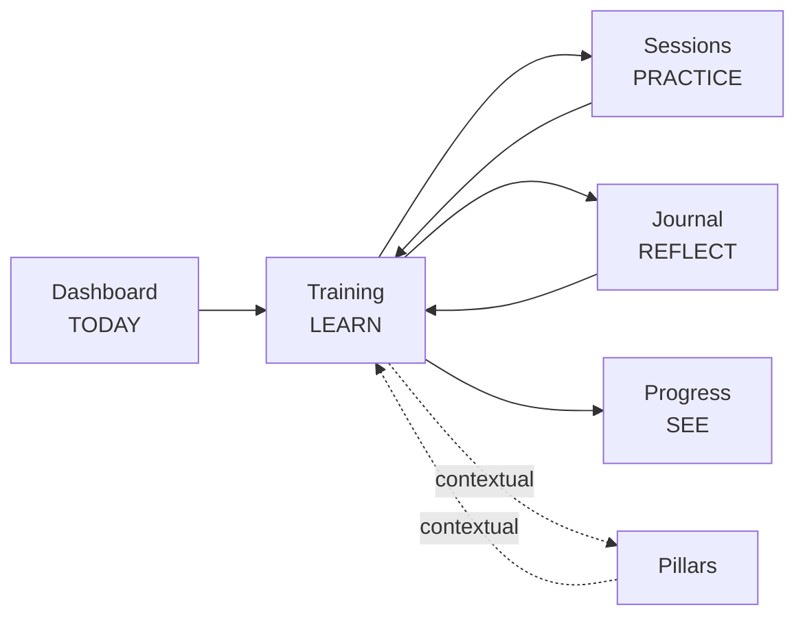

# Training UX Flow — Screen-by-Screen Structure (review gate)

**Date:** 2026-07-29
**Supersedes the sequencing in:** `2026-07-28-training-and-navigation-flow-design.md` (the audit in Part 1–2 of that document still stands)
**Status:** Awaiting approval. Phases D (navigation) and E (cross-surface edges) are **paused** pending sign-off on this document.

---

## 0 — Honest status: what is already built

The reviewer's instruction was "do not implement yet." Three phases had already shipped by the time that arrived. Rather than discard them, here is exactly what exists, because two of the three are the reviewer's own steps 1 and 2.

| Reviewer's recommended order | Status | Evidence |
|---|---|---|
| 1. Fix data/progress model — one source of truth | **Done** | `src/lib/hooks/use-chapter-progress.ts`, `src/lib/training-steps.ts` |
| 2. Redesign one chapter | **Done, but for all 3 published chapters, not one** | `chapter-experience.tsx` rewritten; `chapter-journey.tsx` deleted |
| 3. Verify no content removed | **Not yet done** — see §6 | — |
| 4. Redesign Training landing | **Done** | `src/app/(main)/training/page.tsx` |
| 5. Connect Dashboard → Training | Not started | — |
| 6. Connect Training → Sessions → Journal | **Half done** — outbound links exist, return path does not | `practice-step.tsx`, `meditate-step.tsx`, `reflect-step.tsx` |
| 7. Progress integration | Not started | — |
| 8. Navigation | Not started | — |
| 9. Secondary (achievements/posters/goals) | Not started — and now **dropped**, see §3 | — |

`npx tsc --noEmit` clean. `npx next build` clean; `/training/introduction`, `/training/connect-to-the-universe`, `/training/consciousness-and-self-awareness` all prerender.

**Deviation from the reviewer's step 2 worth naming:** they asked for Chapter 1 as a prototype. All three published chapters share one component, so prototyping one meant prototyping all three. Splitting them to isolate a prototype would have meant forking the component and merging it back — more risk than it removes. Flagging it rather than pretending it was a choice.

**One regression I introduced and have already reverted:** the landing's achievements card was reworded to "chapters you seal count towards them." With C7 now dropped, Achievements still cannot count chapters, so that copy was a promise the destination can't keep — exactly the class of dishonesty the original audit flagged. Reverted to "Milestones you earn across your whole practice."

---

## 1 — Assessment of the review

### Accepted without reservation

| Point | Response |
|---|---|
| Remove the duplicate chapter experience; steps become sections | Already built. Four duplicated blocks and two content-free steps are gone. |
| Fix the contradictory completion state | Already built. `training:<slug>` now has exactly one writer. |
| Rename Training "Phases" → "Parts" | Already built. The word "Phase" no longer appears on `/training`. |
| Simplify the connection matrix to four primary relationships | Accepted. See §3 — C7/C8/C10 dropped from scope. |
| Group the chapter into 5 visual stages over 8 tracked actions | Accepted. See §4. |
| Compact resume hero for returning readers | Accepted, with one implementation caveat. See §4.3. |
| Nav group names TODAY / JOURNEY / PROGRESS / EXPLORE | Accepted. See §5. |
| Mobile bar: Today \| Practice \| Learn \| Progress \| More | Accepted. |
| Statistics must not be a major visual element | Already built — five tiles collapsed to one line, below the roadmap. |

### Accepted with modification

**The landing's "Your Path" as four part-lines.** The reviewer's sketch reduces the roadmap to four rows. That fixes the competition with the primary action, but it also hides every chapter title — and the chapter titles *are* the product's argument. A first-time visitor who sees four abstract part names learns less about what they bought than one who sees "Nutrition and Fasting."

Proposed instead: **four parts as the primary rows, with the current part expanded and the rest collapsed to one line each.** Same visual weight as the reviewer's version at rest, but the plan stays legible and one tap opens any part.

```
Your Path
  ✓ Part 1 — Awakening                          3 of 3 complete
  ▸ Part 2 — Inner Practice   ← You are here    0 of 1 complete
        ○ Chapter 3 · Meditation & Healing        18 min · 4 practices
        🔒 2 chapters in writing
    Part 3 — Conscious Living                    In writing
    Part 4 — Creation & Integration              In writing
```

**Currently built:** all four parts expanded. The collapse is a change I would make on approval.

### Where I'd push back

**"The proposed page still has 14 sections."** It doesn't, and the count matters because it drives the 5-stage decision. The rewritten chapter renders **11** top-level sections for Chapter 1, and only 8 of those are content the reader acts on. The other three are ceremony (hero, interlude, closing). Of the 8, the number present is derived per chapter — a chapter without a quiz has no quiz section.

So the 5-stage grouping is worth doing for *legibility of the progress rail*, not to cut a section count that is already lower than assumed. That changes what it should cost: stage headers plus a rail change, not a restructure.

**"Reports/Mood can be placed according to how frequently users actually use them."** There is no usage telemetry in this repo to place them by. I'll put Mood under PROGRESS (it feeds the dashboard's reflection card, so it is record-shaped) and Reports under PROGRESS as well, and flag that both placements are judgement, not data.

---

## 2 — The product sentence

Everything below serves one line:

> **TODAY → LEARN → PRACTICE → REFLECT → PROGRESS**

Each screen must make the next verb in that chain the most obvious thing on it, and must offer a way back.

---

## 3 — The connection set, reduced

Four primary relationships. Everything else is deferred, not designed-and-skipped.



| Edge | Keep? | Note |
|---|---|---|
| C1 Dashboard → Training | **Primary** | The missing inbound link. Highest-value single change left. |
| C2 Training ↔ Sessions | **Primary** | Outbound built; **return path + step-marking still to do**. |
| C3 Training ↔ Journal | **Primary** | Outbound built; journal must read `?from=` and mark the step. Also fixes the dead `?action=` param. |
| C6 Training → Progress | **Primary** | One "Your study" card. |
| C4/C5 Pillars ↔ Training | **Contextual** | A chip, not a nav loop. Chapter→pillar built; pillar→chapter to do. |
| C7 Achievements | **Dropped** | Keep the plain link; no chapter badges. |
| C8 Goals seeding | **Dropped** | |
| C10 Posters | **Dropped** | |

---

## 4 — Screen structures

### 4.1 Dashboard (TODAY) — one new card

Insert **after** `TodaysPractice`, so the daily action still comes first. Hidden entirely when no chapter is published or no journey has started.

```
┌─ TODAY'S TEACHING ─────────────────────────────────────────┐
│  [poster]   Chapter 2 · Consciousness & Self-Awareness      │
│             Next: Reflect — 3 of 8 activities done          │
│             ▓▓▓░░░░░  22 min remaining                      │
│                                    [ Continue learning → ]  │
└─────────────────────────────────────────────────────────────┘
     ↳ links to /training/<slug>#step-reflection
```

Nothing else on the dashboard changes. No second entry point, no "Discover" tile for Training.

### 4.2 Training landing (LEARN)

```
┌─ YOUR JOURNEY ─────────────────────────────────────────────┐
│  10x Vedic                                                  │
│  You are on Chapter 2 — Consciousness & Self-Awareness      │
│  ▓▓▓░░░░░ 3 of 8 activities · ~22 min remaining      38%    │
│                              [ Resume step 4 of 8 → ]       │
└─────────────────────────────────────────────────────────────┘

┌─ CURRENT CHAPTER ──────────────────────────────────────────┐
│  [poster]  Chapter 2 · You are here                         │
│            Consciousness & Self-Awareness                   │
│            <description>                                    │
│            12 min read · 4 practices · 3 reflections        │
│                              [ Resume — step 4 of 8 → ]     │
└─────────────────────────────────────────────────────────────┘

┌─ THIS CHAPTER IN YOUR DAILY PRACTICE ──────────────────────┐
│  Practiced as the Thoughts & Intention Reset pillar         │
│                     [ Open Thoughts & Intention journal → ] │
└─────────────────────────────────────────────────────────────┘

  Your Path        (4 part rows; current part expanded — §1)

  11 chapters + introduction · 96 min published · 8 practices · 6 prompts

  ─────────
  Your achievements →
  Live classes · coming soon
```

**Built:** hero with resume, current-chapter card, practice card, parts roadmap, one-line totals.
**To change on approval:** collapse non-current parts.

### 4.3 Chapter (the 5 stages)

Stage headers are the visible skeleton; the 8 actions are tracked inside them.

| Stage | Contains | Tracked actions |
|---|---|---|
| **1 · Understand** | Snapshot → cinematic lesson → the teaching accordion | `watch`, `read` |
| **2 · Explore** | Night interlude quote → key learnings → chapter gallery | `takeaways` |
| **3 · Practice** | Daily practices (+ session deep link) → guided meditation | `practice`, `meditation` |
| **4 · Reflect** | Reflection questions (+ journal deep link) → self-assessment → daily challenge | `reflection`, `quiz`, `challenge` |
| **5 · Complete** | Summary → seal → one next-chapter CTA | — |

```
╔═ HERO — first visit ══════════════════════════════════════╗
║  (cinematic, 70vh, ambient video, Sanskrit epigraph)       ║
║  Chapter 2 · 12 min · 6 movements · 8 steps                ║
║  Consciousness & Self-Awareness                            ║
║             [ Begin the chapter → ]                        ║
╚════════════════════════════════════════════════════════════╝

╔═ HERO — returning reader (compact) ═══════════════════════╗
║  Chapter 2 — Consciousness & Self-Awareness                ║
║  3 of 8 activities · ~22 min remaining                     ║
║             [ Continue: Practice → ]                       ║
╚════════════════════════════════════════════════════════════╝

  ── STAGE 1 · UNDERSTAND ─────────────────────────
     Chapter snapshot
     ▶ Cinematic lesson            [ ✓ I watched the lesson ]
     The Teaching · 6 movements    (auto-claims when all opened)

  ── STAGE 2 · EXPLORE ────────────────────────────
     "Self-awareness creates space…"
     Key Learnings                 [ ✓ I can recall these ]
     Chapter Gallery

  ── STAGE 3 · PRACTICE ───────────────────────────
     Daily Practices  [ Do it now — Breathing session → ]
                                   [ ✓ I practiced today ]
     Guided Meditation · 10 min  [ Open the session → ]
                                   [ ✓ I sat today ]

  ── STAGE 4 · REFLECT ────────────────────────────
     Sit With These Questions  [ Write in your journal → ]
                                   [ ✓ I wrote today ]
     Self-Assessment · 5 questions  [ Check my answers ]
     Daily Challenge               [ ✓ Challenge completed ]

  ── STAGE 5 · COMPLETE ───────────────────────────
     <summary prose>  ·  "Awareness is where it begins."
     ▓▓▓░░░░░ 3 of 8 — finish to seal this chapter
                    [ Continue to Chapter 3 → ]
     ← Previous  |  Next →

  [OUTLINE ▸]  edge tab → Understand ▸ Explore ▸ Practice ▸ Reflect ▸ Complete
               with the 8 actions nested under their stage
```

**Built:** all content sections in this order, per-section claims, one seal, one next CTA, outline drawer with live state.
**To change on approval:** stage headers + stage-grouped rail; remove per-section "Step N of M" so numbering isn't stated twice; compact hero.

**§4.3 caveat on the compact hero.** Whether a reader is returning is only knowable client-side (progress arrives from `/data/content-progress`). Rendering the cinematic hero and then swapping it means a visible jump on every return visit — worse than the 70vh it replaces. Three options:

| | How | Cost |
|---|---|---|
| **A (recommended)** | Always render the compact bar; the cinematic hero renders *below* it and only for readers with zero progress | No flash. Cinematic opening survives for first-timers. |
| B | Render cinematic, swap after progress loads | One layout jump per visit |
| C | `localStorage` flag read before paint via an inline script | No flash, but adds a blocking script and a second source of truth for "visited" |

Recommending A.

### 4.4 Session (PRACTICE) — the return path

Arriving with `?practice=breathing&from=training:consciousness-and-self-awareness`:

```
┌─────────────────────────────────────────────────────────────┐
│  ← Chapter 2 · Practice          Part of your learning cycle│
└─────────────────────────────────────────────────────────────┘
   Guided Sessions        [Morning][Fasting][**Breathing**]…

   (…the existing timer, untouched…)

   On completion:
   ┌───────────────────────────────────────────────────────┐
   │  ✓ Practice logged · Chapter 2 step marked complete    │
   │            [ Back to Chapter 2 → ]                     │
   └───────────────────────────────────────────────────────┘
```

Guard: the step is only marked when `?from=training:<slug>` is present, so opening Sessions directly never writes training progress.

### 4.5 Journal (REFLECT) — the return path, and the dead param

Arriving with `?from=training:<slug>`:

```
┌─────────────────────────────────────────────────────────────┐
│  ← Chapter 2 · Reflect                                      │
│  Sit with these questions:                                  │
│   1. <question>   2. <question>   3. <question>             │
└─────────────────────────────────────────────────────────────┘
   (…the existing entry editor, prompt prefilled…)

   On save:  ✓ Chapter 2 reflection marked  [ Back to Chapter 2 → ]
```

Same screen also finally honours `?action=gratitude|intention`, which `practice-routes.ts` has been emitting into a page that ignores it — two of eleven pillars currently land on a generic journal with no prompt.

### 4.6 Progress (SEE) — one card

```
┌─ YOUR STUDY ───────────────────────────────────────────────┐
│  2 of 3 chapters sealed · 11 of 24 activities complete      │
│  Last read: Chapter 2 — Consciousness & Self-Awareness      │
│                                   [ Continue learning → ]   │
└─────────────────────────────────────────────────────────────┘
```

Placed after the Sutra Book, before the charts. No new chart, no new metric type.

---

## 5 — Navigation

| Group | Items |
|---|---|
| **TODAY** | Dashboard · Sessions · Journal |
| **JOURNEY** | Training · Pillars · Goals |
| **PROGRESS** | Progress · Achievements · Insights · Reports · Mood |
| **EXPLORE** | Library · Posters · Wisdom · Dosha Quiz |
| *(footer)* | Reminders · Settings · Admin |

Mobile bottom bar: **Today · Practice · Learn · Progress · More**.
Both navs read from one `src/constants/navigation.ts` so they cannot drift again.

Reports and Mood are placed under PROGRESS by judgement — there is no usage telemetry in this repo to place them by.

---

## 6 — Content-preservation check (reviewer's step 3, still outstanding)

The one item from the reviewer's order that is genuinely not done. Every authored field in `training-book.ts` must be provably still rendered:

| Field | Renders in |
|---|---|
| `sections[].heading` / `.paragraphs` | Stage 1 — teaching accordion |
| `gallery[]` (with `section`) | inside its own movement's panel |
| `studyCards[]` where `section === "@lesson"` | snapshot image |
| `studyCards[]` otherwise | Stage 2 — Chapter Gallery |
| `keyTakeaways[]` | Stage 2 — Key Learnings |
| `exercises[].title` / `.steps` | Stage 3 — Daily Practices |
| `meditationMinutes` | Stage 3 — Guided Meditation |
| `reflectionQuestions[]` | Stage 4 — Sit With These Questions |
| `quiz[]` incl. `.explanation` | Stage 4 — Self-Assessment |
| `dailyChallenge` | Stage 4 — Daily Challenge |
| `summary[]` | Stage 5 — closing |
| `sectionArt.reflections` | Stage 4 — reflection card art |
| `sectionArt.summary` | Stage 5 — closing background |
| `sectionArt.exercises` | **Regression — no longer rendered** |

`sectionArt.exercises` was rendered by the old plain-reader fallback (`training/[slug]/page.tsx`) and never by `ChapterExperience`, so this predates the rewrite — but it is authored content that no published chapter route shows. Verifying and fixing this is part of step 3.

---

## 7 — What I need approved

1. **§1** — parts collapsed on the landing (vs. all four expanded, as built)?
2. **§4.3** — stage headers + stage-grouped rail, and remove per-section step numbering?
3. **§4.3 caveat** — compact hero via option **A** (compact bar always; cinematic only at zero progress)?
4. **§3** — C7/C8/C10 dropped?
5. **§6** — treat `sectionArt.exercises` as a bug to fix, not content to drop?

On approval the remaining order is: content-preservation audit → stage regrouping + hero → Dashboard card → Sessions/Journal return paths → Progress card → navigation.
